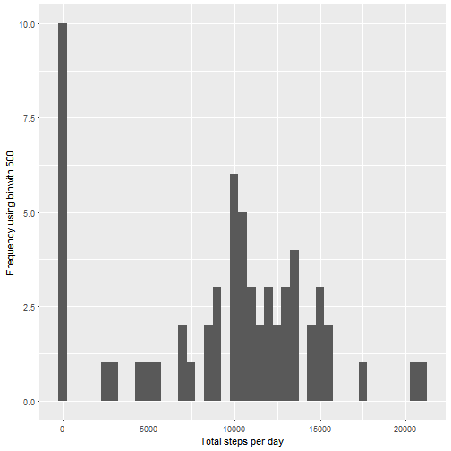
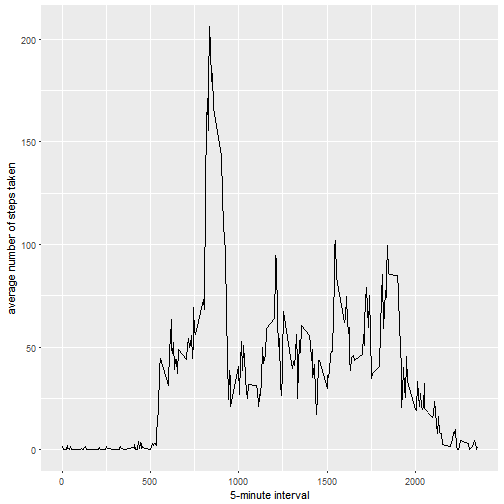
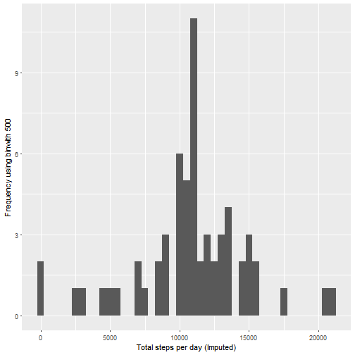
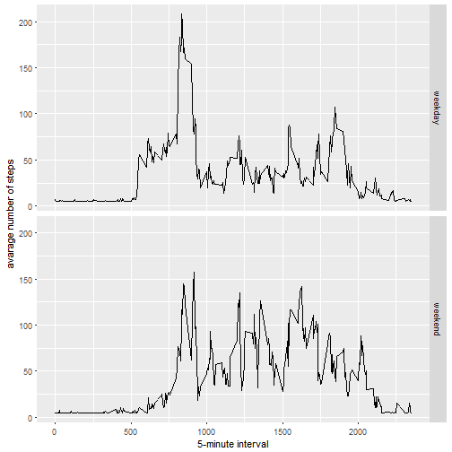

R Markdown- Reproducable Research Peer Assessment Project 1
=======================================================================

1. Load and preprocess the data (i.e. read.csv())


```r
#install.packages("ggplot2")
#install.packages("scales")
#install.packages("Hmisc")

library(ggplot2)
library(scales)
library(Hmisc)

activityData <- read.csv('activity.csv')
##not making any changes
```


2. What is mean total number of steps taken per day?


```r
stepsByDay <- tapply(activityData$steps, activityData$date, sum, na.rm=TRUE)
qplot(stepsByDay, xlab='Total steps per day', ylab='Frequency using binwith 500', binwidth=500)
```



```r
stepsByDayMean <- mean(stepsByDay)
stepsByDayMedian <- median(stepsByDay)

#Mean Steps
stepsByDayMean
```

```
## [1] 9354.23
```

```r
#Median
stepsByDayMedian
```

```
## [1] 10395
```


3. What is the average daily activity pattern?


```r
averageStepsPerTimeBlock <- aggregate(x=list(meanSteps=activityData$steps), by=list(interval=activityData$interval), FUN=mean, na.rm=TRUE)

ggplot(data=averageStepsPerTimeBlock, aes(x=interval, y=meanSteps)) +
    geom_line() +
    xlab("5-minute interval") +
    ylab("average number of steps taken")
```



```r
mostSteps <- which.max(averageStepsPerTimeBlock$meanSteps)
timeMostSteps <-  gsub("([0-9]{1,2})([0-9]{2})", "\\1:\\2", averageStepsPerTimeBlock[mostSteps,'interval'])

#5 minute interval with maximum number of steps
timeMostSteps
```

```
## [1] "8:35"
```


4.Imputing missing values


```r
numMissingValues <- length(which(is.na(activityData$steps)))
#Number of missing values
numMissingValues
```

```
## [1] 2304
```

```r
#Using the mean # of steps to fill in the missing values
activityDataImputed <- activityData
activityDataImputed$steps <- impute(activityData$steps, fun=mean)

stepsByDayImputed <- tapply(activityDataImputed$steps, activityDataImputed$date, sum)
qplot(stepsByDayImputed, xlab='Total steps per day (Imputed)', ylab='Frequency using binwith 500', binwidth=500)
```



```r
stepsByDayMeanImputed <- mean(stepsByDayImputed)
stepsByDayMedianImputed <- median(stepsByDayImputed)

#Mean Steps
stepsByDayMeanImputed
```

```
## [1] 10766.19
```

```r
#Median
stepsByDayMedianImputed
```

```
## [1] 10766.19
```

```r
#There is a distinct difference between the imputed mean and median vs the non-imputed 
#The mean and median is exactly the same in the imputed version
```


5. Are there differences in activity patterns between weekdays and weekends?


```r
activityDataImputed$dateType <-  ifelse(as.POSIXlt(activityDataImputed$date)$wday %in% c(0,6), 'weekend', 'weekday')

averagedActivityDataImputed <- aggregate(steps ~ interval + dateType, data=activityDataImputed, mean)
ggplot(averagedActivityDataImputed, aes(interval, steps)) + 
    geom_line() + 
    facet_grid(dateType ~ .) +
    xlab("5-minute interval") + 
    ylab("avarage number of steps")
```


